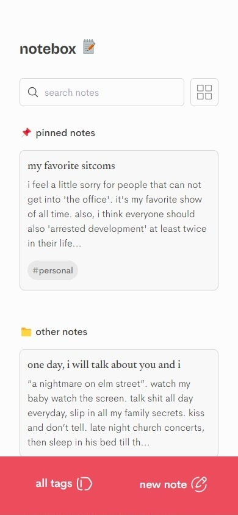
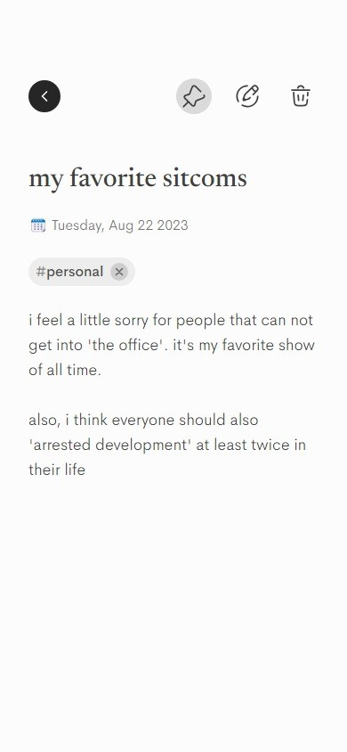
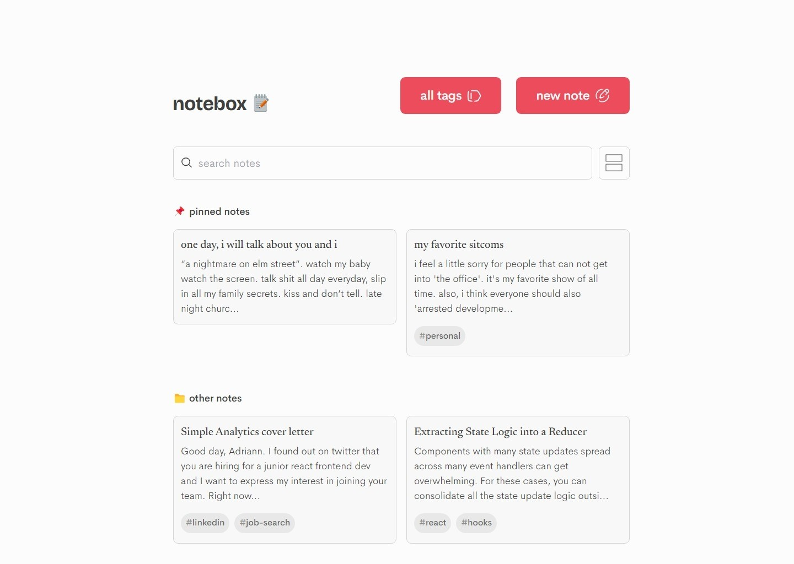
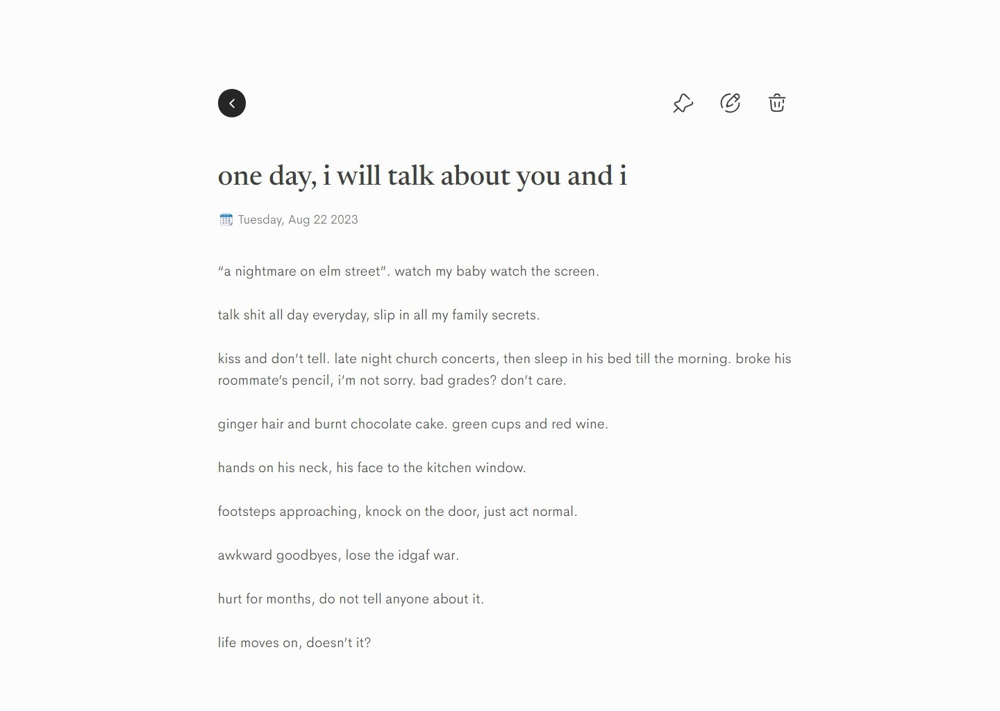

# notebox

   effortlessly create, edit, delete, and organize your notes with a user-friendly web app.s

## live

   [mynotebox.netlify.app](https://mynotebox.netlify.app/)

## core features

- creating and editing notes: users can create new notes with content. note titles, tags, and content can be updated when editing existing notes.
- deleting notes: users can delete notes they no longer need. a confirmation prompt is available to prevent accidental deletions.
- tagging notes: each note supports the addition of multiple custom tags. users can tag their notes with keywords for better organization and easy retrieval. users can also delete tags.
- Search by tags: implemented a search functionality that allows users to filter notes based on tags, helping users quickly find relevant notes.
- sorting by newly created: notes are displayed in a list (with a grid view also available), and are sorted by default with the most recently created. notes can also be sorted into a pinned folder to easily access relevant notes.

## additional Features

- [x]  **user-friendly ui**: prioritized an aesthetically pleasing and user-friendly design, a clean and intuitive interface enhances the user experience, including cta texts and empty states.
- [x]  **responsive design**: the app is fully responsive to various screen sizes, from desktops to mobile devices.
- [x]  **local storage**: used local storage to save notes locally in the browser. local storage data is also validated to avoid errors.
- [x]  **error handling**: not found page and note error page. 

## guidelines:

- [x]  code structure, quality and organization; best practices, modular component-based structure
- [x]  appealing and responsive design.
- [x]  state management using context api
- [x]  granular, regular commits
- [x]  proper documentation, readme file should contain a live link
- [x]  implementation of the required features
- [x]  aesthetic design and user experience
- [x]  cross-browser compatibility

## stack

react (context api for state management), typescript, tailwind css.

## preview
  |||
  | ------------- | ------------- |
  |  |  |
  | mobile home page screenshot | mobile single note screenshot |

  
  |||
  | ------------- | ------------- |
  |  |  |
  | desktop home page screenshot | desktop single note screenshot |
